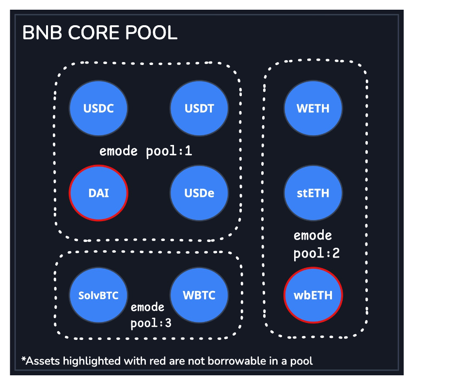

# E-Mode in Venus Protocol


Not yet available. It will be only available on BNB Chain Core Pool.


## Overview

The Venus Protocol introduces **E-Mode (Efficiency Mode)** to the **BNB Chain Core Pool**, a new feature designed to **boost capital efficiency** for different asset pools, such as stablecoins or ETH-based tokens. It also aims to **isolate the risk** within these pools while reusing liquidity from the Core Pool.

E-Mode allows users to activate specialized **asset pools** within the Core Pool, each with **customized risk settings**. By selecting an E-Mode pool, your eligible assets follow optimized parameters for **collateral factor (CF)** and **liquidation threshold (LT)**, which are **increased**, while the **liquidation incentive (LI) is decreased**, making borrowing more efficient and cost-effective while keeping risks contained.

## What’s Changed

To support E-Mode, the Core Pool itself has been **enhanced with new risk mechanics**:

* **Liquidation Threshold (LT) Support** – Similar to isolated pools, LT is now used to determine liquidation conditions, separate from CF.
* **Per-Market Liquidation Incentive (LI)** – LI is no longer global; each market has its own incentive, configurable by Governance.
* **User-Specific Risk Factors** – Effective CF, LT, and LI now depend on the user’s selected E-Mode pool, giving each user a tailored borrowing and collateral profile.

## Architecture Overview

E-Mode operates as a **lightweight overlay on the Core Pool**, enabling per-user risk management without moving funds to separate pools.

* **Core Pool (poolId = 0)**: The default pool for all users. Supports **per-market LIs** and **LT**, even for non-E-Mode users.
* **E-Mode Pools (poolId > 0)**: Each pool defines a pool of assets (e.g., Stablecoin Pool, ETH Pool) with customized CF, LT, and LI for each asset in the pool. Users select a pool to activate its risk parameters.
* **Pool-Market**: Markets are tracked per pool, allowing **pool-specific overrides** while preserving Core Pool compatibility.
* **User Pool Tracking**: Each user is associated with exactly one pool at a time via `userPoolId`. Switching pools updates this mapping and triggers the relevant risk rules.

<figure><figcaption>
<em>emode</em>
</figcaption></figure>

This architecture ensures **flexibility, backward compatibility, and gas efficiency**, while giving users **higher borrowing efficiency and better risk isolation**.

## Impact on Users

* **No Action Needed** – Users remain in the Core Pool by default. Their positions continue to function normally without switching to E-Mode.
* **Optional Upgrade** – By entering an E-Mode pool, your account will use its risk settings for approved assets.
* **Note: Improved Risk Mechanics** – Even without switching, Core Pool users now benefit from **per-market liquidation incentives (LI)** and **liquidation threshold (LT) support**, making liquidation calculations and account health evaluations more precise.

## Impact on Liquidators

E-Mode introduces more precision and flexibility for liquidators in the Core Pool:

* **Per-Market Liquidation Incentives** – Each market now has its own liquidation incentive. Liquidators need to consider these differences to maximize returns.
* **Liquidation Thresholds (LT)** – LT now determines when accounts can be liquidated, replacing the older CF-based check for liquidations.
* **User-Specific Risk Factors** – Effective CF, LT, and LI can vary per user depending on their E-Mode pool, making liquidation decisions more targeted and strategic.

This gives liquidators **smarter targeting, higher transparency, and better reward optimization** across markets.

## How It Works

1. **Default in the Core Pool**  
   All users start in the Core Pool and can continue their positions normally.

2. **Select an E-Mode Pool**  
   Explore available pools (e.g., Stablecoin) via the Venus App or Venus Lens.

3. **Check Your Borrows**  
   Borrowed assets must be approved in the selected pool. Repay any disallowed assets first.

4. **Enter E-Mode**  
   Eligible assets follow E-Mode risk settings, while non-pool assets continue using Core Pool parameters.

5. **Enjoy Higher Efficiency**  
   Borrow and manage positions with optimized collateral and liquidation rules.

For a **detailed technical explanation**, including implementation and user examples, check out the [full E-Mode technical article](../technical-reference/reference-technical-articles/emode.md).
