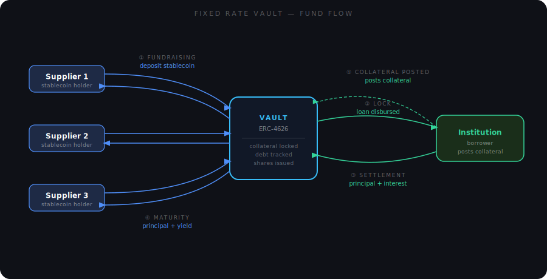
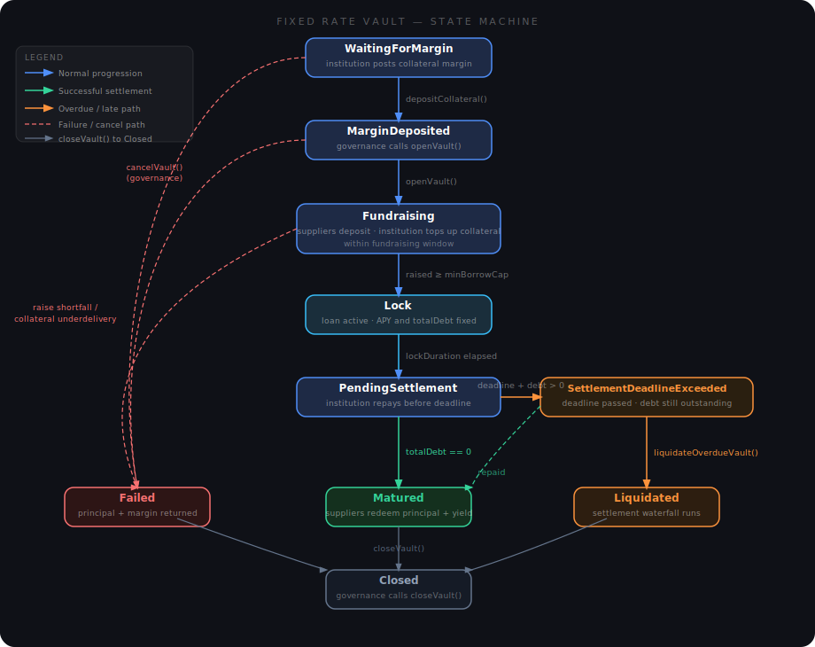

# Fixed Rate Vaults

Venus Protocol is introducing a new way to earn and borrow: **Fixed Rate Vaults**.

Instead of the variable rates and shared liquidity pools of Venus core markets, Fixed Rate Vaults offer something simpler and more predictable. An institution wants to borrow stablecoins for a set period at a set rate. Suppliers fund that loan, earn a fixed APY, and get their principal back at maturity. No rate fluctuations, no surprises — just a clear term with a clear outcome.

Each vault is **entirely self-contained**. It involves one stablecoin, one institution, and one contract. It shares no liquidity, no risk parameters, and no liquidation flow with Venus core markets or any other vault. Each vault stands or falls on its own.

Every vault implements the **ERC-4626 tokenised vault standard**, so suppliers interact through the familiar `deposit`, `withdraw`, `redeem`, and `balanceOf` interface — no custom integration required. Share tokens are standard ERC-20s, freely transferable at any point in the vault's life.

<figure><figcaption>
Suppliers deposit stablecoin into the vault, the institution receives the loan and repays with interest, and suppliers redeem principal plus yield at maturity
</figcaption></figure>

## How a Vault Progresses

<figure><figcaption>
Fixed Rate Vault state transitions
</figcaption></figure>

Every vault follows the same journey from creation to close. States move in one direction only — there's no going back.

1. **Waiting for margin** — the vault exists on-chain, but the institution must post the full required collateral margin in a single transaction before anything else can happen.
2. **Margin deposited** — the margin is locked in escrow. Governance reviews the vault and calls `openVault()` to begin the fundraising window.
3. **Fundraising** — suppliers can now deposit. The vault accepts stablecoins up to its maximum borrow cap. During this same window, the institution tops up their collateral to the required level. Both sides must complete their part before the window closes.
4. **Lock** — fundraising succeeded. The fixed-term loan begins. Total interest is computed and fixed immediately as a single lump sum — the full lifetime obligation is known from this moment.
5. **Pending settlement** — the lock period has ended. The institution now has until the settlement deadline to repay principal plus interest in full.
6. **Settlement deadline exceeded** — the deadline passed with debt still outstanding. The institution can still repay voluntarily; if they don't, whitelisted settlers can trigger overdue liquidation.
7. **Terminal states** — the vault resolves into one of three outcomes, after which governance calls `closeVault()`:
   - **Matured** — the institution repaid in full. Suppliers redeem their shares for principal plus yield.
   - **Failed** — two distinct cases: (a) *Raise shortfall* — not enough suppliers funded the vault; suppliers recover their principal and the institution recovers all collateral including the margin. (b) *Collateral underdelivery* — the raise met its minimum but the institution didn't post full collateral by close; the margin is confiscated and distributed pro-rata to suppliers in the collateral asset.
   - **Liquidated** — bad-debt rescue completed. The collateral value fell below outstanding debt and a permissionless repayer covered the principal; suppliers redeem against the settlement waterfall over the remaining assets.

## Participants

### Suppliers

Fixed Rate Vaults are designed to give lenders certainty:

- **You know your yield upfront.** The APY and lock duration are fixed before fundraising opens — there's nothing to guess or monitor.
- **Collateral is posted before you can deposit.** The institution's margin is on-chain and locked before the fundraising window opens. Combined with full vault isolation, a default in one vault cannot affect any other vault or Venus core markets.
- **Your position stays liquid.** Vault shares are transferable ERC-20s. You can move or sell them to another party at any time during the vault's life.

### Institutions

Fixed Term Vaults give borrowers control over their cost of capital:

- **Predictable cost.** The target APR is fixed at vault creation — no variable-rate exposure over the loan term.
- **Your collateral stays safe.** It is locked in the vault contract and never lent out or rehypothecated — no third party can touch it. If it appreciates during the loan, that upside is still entirely yours.
- **Plan your repayment from day one.** The total amount owed is calculable at lock entry, so there are no surprises when the settlement window opens.

## Liquidations

Fixed Term Vaults run their own liquidation system, independent of Venus core. Two paths exist:

- **Health-based liquidation** — available during the Lock and settlement phases if the vault's outstanding debt exceeds the liquidation-threshold value of its collateral. Whitelisted liquidators repay a portion of the debt (capped by the global close factor) and receive collateral at the liquidation incentive rate. A share of the bonus goes to the protocol.
- **Overdue liquidation** — available once the institution has missed the settlement deadline, regardless of collateral health. The same close-factor cap applies, but collateral is seized at the late-penalty rate.

Both paths route through the `LiquidationAdapter`, which maintains separate ACM-gated whitelists for health-based liquidators and overdue settlers. Direct vault calls are blocked.

## Go Deeper

- [Supplier Guide](../guides/fixed-rate-vaults/supplier-guide.md) — step-by-step walkthrough for lenders.
- [Institution Guide](../guides/fixed-rate-vaults/institution-guide.md) — step-by-step walkthrough for borrowers.
- [Fixed Term Vaults Technical Reference](../technical-reference/reference-technical-articles/fixed-rate-vaults.md) — contract architecture, math, and liquidation paths in full detail.
- [Solidity API Reference](../technical-reference/reference-fixed-rate-vaults/README.md) — full function-level reference for all contracts.
