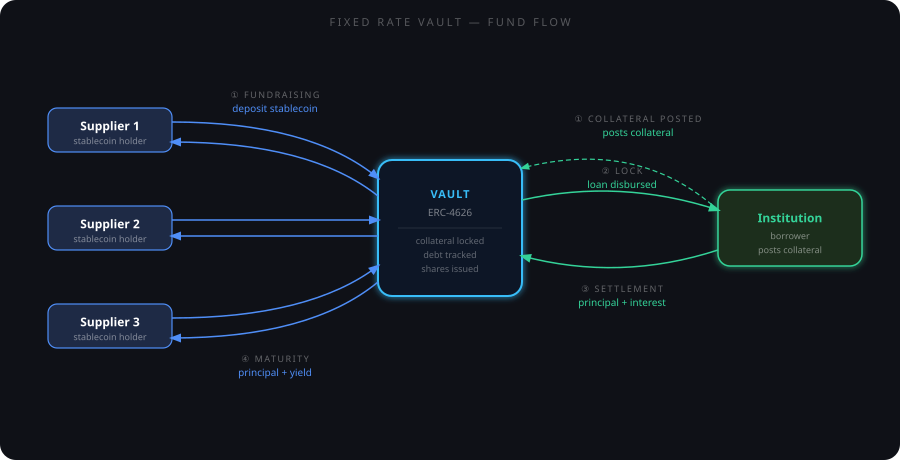
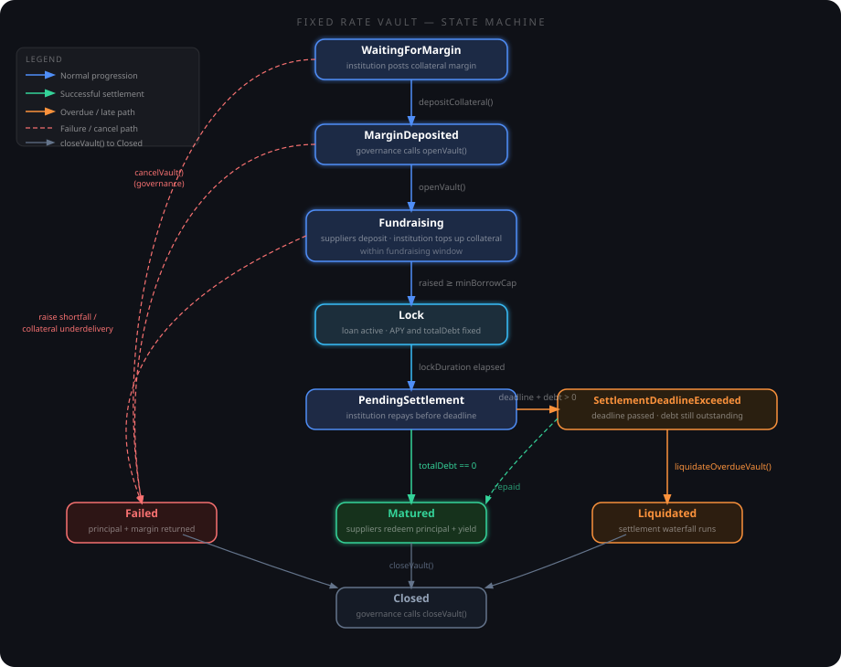

# Fixed Term Vaults

Venus Protocol is introducing a new way to earn and borrow: **Fixed Term Vaults**.

Instead of the variable rates and shared liquidity pools of Venus core markets, Fixed Term Vaults offer a scheduled rate and term set when the vault is created. An institution borrows stablecoins against collateral, and suppliers receive ERC-20 vault shares representing a claim on the assets available at settlement. Principal and target interest are not guaranteed: a shortfall or liquidation can reduce the amount redeemable.

Each loan uses a separate vault clone with its own collateral, debt accounting, and supplier shares; it does not share liquidity with Venus Core markets or other vault clones. The system still depends on shared controller, PositionToken, oracle, ProtocolShareReserve, LiquidationAdapter, and governance components, and some risk and liquidation settings can change.

Every vault exposes an **ERC-4626 tokenised vault interface**, with lifecycle constraints on methods such as `deposit`, `withdraw`, and `redeem`. Share tokens are standard ERC-20s and can be transferred, but transferability does not guarantee a buyer, secondary market, or sale price.

<figure><figcaption>
Suppliers supply stablecoins into the vault, the institution receives the loan, and suppliers redeem their pro-rata share of the assets available at settlement
</figcaption></figure>

## How a Vault Progresses

<figure><figcaption>
Fixed Term Vault state transitions
</figcaption></figure>

Every vault follows the same journey from creation to close. States move in one direction only — there's no going back.

1. **Waiting for margin** — the vault exists on-chain, but the institution must post the full required collateral margin in a single transaction before anything else can happen.
2. **Margin deposited** — the margin is locked in escrow. Governance reviews the vault and calls `openVault()` to begin the fundraising window.
3. **Fundraising** — suppliers can now supply. The vault accepts stablecoins up to its maximum borrow cap. During this same window, the institution tops up their collateral to the required level. Both sides must complete their part before the window closes.
4. **Lock** — fundraising succeeded. The fixed-term loan begins. Total interest is computed and fixed immediately as a single lump sum — the full lifetime obligation is known from this moment.
5. **Pending settlement** — the lock period has ended. The institution now has until the settlement deadline to repay principal plus interest in full.
6. **Settlement deadline exceeded** — the deadline passed with debt still outstanding. The institution can still repay voluntarily; if they don't, whitelisted settlers can trigger overdue liquidation.
7. **Terminal states** — the vault resolves into one of three outcomes, after which governance calls `closeVault()`:
   - **Matured** — the institution repaid in full. Suppliers redeem their shares for principal plus yield.
   - **Failed** — two distinct cases: (a) *Raise shortfall* — not enough suppliers funded the vault; suppliers recover their principal and the institution recovers all collateral including the margin. (b) *Collateral underdelivery* — the raise met its minimum but the institution didn't post full collateral by close; the margin is confiscated and distributed pro-rata to suppliers in the collateral asset.
   - **Liquidated** — bad-debt rescue completed. The collateral value fell below outstanding debt and a permissionless repayer covered the principal; suppliers redeem against the settlement waterfall over the remaining assets.

## Participants

### Suppliers

Fixed Term Vaults are designed to give lenders certainty:

- **The scheduled rate and term are set upfront.** The target APR and lock duration are set before fundraising opens. Actual redemption still depends on the vault's terminal state and settlement assets.
- **Collateral is posted before you can supply.** The institution's margin is on-chain and locked before the fundraising window opens. Each vault has separate assets and accounting, so a default does not directly draw liquidity or collateral from another vault or Venus Core market. Vaults still depend on shared system components and governance.
- **Vault shares are transferable, but early liquidity is not guaranteed.** Shares are ERC-20 tokens and can be transferred, but Venus does not guarantee a buyer, secondary market, or sale price. The vault's `withdraw` and `redeem` functions are available only after it reaches a terminal state.

### Institutions

Fixed Term Vaults give borrowers control over their cost of capital:

- **Scheduled interest cost.** The target APR is fixed at vault creation rather than accruing at a variable borrow rate. Liquidation and late-penalty terms remain separate risk parameters.
- **Collateral is held in the vault and is not lent or rehypothecated.** It remains subject to the vault's health checks and documented liquidation paths, under which authorized liquidators or settlers can receive seized collateral. The controller also has governance-controlled pause and recovery functions. Any collateral remaining for the position-token holder is subject to the vault's debt, liquidation, and settlement rules.
- **Plan the scheduled repayment from day one.** The scheduled interest is calculated at lock entry. Liquidation conditions, penalties, and the final settlement outcome remain subject to the vault's risk parameters and state.

## Liquidations

Fixed Term Vaults use liquidation entry points and accounting that are separate from Venus Core Pool liquidation. This is not full system independence: the vault paths still rely on the shared ResilientOracle, controller, LiquidationAdapter, ProtocolShareReserve, governance, and configured permissions. Two vault-specific paths exist:

- **Health-based liquidation** — available during the Lock and settlement phases if the vault's outstanding debt exceeds the liquidation-threshold value of its collateral. Whitelisted liquidators submit a debt repayment and receive collateral at the liquidation incentive rate. The vault applies the global close factor to the repayment amount; a request above the allowed amount reverts with `ExceedsCloseFactor` rather than being silently reduced to the limit. A share of the bonus goes to the protocol.
- **Overdue liquidation** — available once the institution has missed the settlement deadline, regardless of collateral health. The same hard-reverting close-factor check applies, but collateral is seized at the late-penalty rate.

Both paths route through the `LiquidationAdapter`, which maintains separate ACM-gated whitelists for health-based liquidators and overdue settlers. Direct vault calls are blocked.

## Go Deeper

- [Supplier Guide](../guides/fixed-rate-vaults/supplier-guide.md) — step-by-step walkthrough for lenders.
- [Institution Guide](../guides/fixed-rate-vaults/institution-guide.md) — step-by-step walkthrough for borrowers.
- [Fixed Term Vaults Technical Reference](../technical-reference/reference-technical-articles/fixed-rate-vaults.md) — contract architecture, math, and liquidation paths in full detail.
- [Solidity API Reference](../technical-reference/reference-fixed-rate-vaults/README.md) — full function-level reference for all contracts.
- [Deployed Contracts](../deployed-contracts/fixed-rate-vaults.md) — published contract addresses and vault-discovery guidance; verify live implementations, configuration, and permissions at a recorded block.
