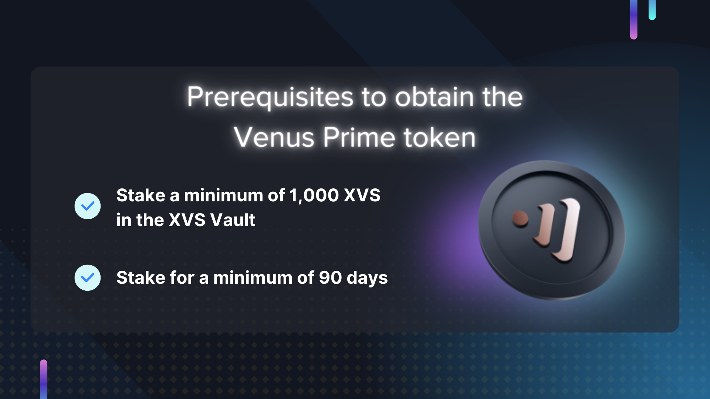

# Prime Yield

## To be released

### **Overview**

Venus Protocol is excited to announce Venus Prime, a revolutionary incentive program aimed to bolster user engagement and growth within the protocol. An integral part of Venus Tokenomics v3.1, Venus Prime aims to enhance yields and promote $XVS staking, focusing on markets including USDT, BNB, BTC and ETH. The launch is targeted for Q3 2023.

### **Venus Prime Essentials**

Venus Prime's uniqueness lies in its self-sustaining rewards system, instead of external sources, rewards are derived from the protocol's revenue, fostering a sustainable and ever-growing program.

Eligible $XVS holders will receive a unique, non-transferable Soulbound Token, which boosts the annual percentage yields (APYs) across selected markets. This token, known as a Prime Token, enables users to enjoy elevated APYs and intensifies their engagement with the protocol.

Venus Prime encourages user commitment through two unique Prime Tokens. The revocable Prime Token can be obtained by staking a minimum of 1,000 XVS for at least 90 days, and the OG Prime Token rewards long-term commitment and active involvement.

<figure><figcaption></figcaption></figure>

### **Expected Impact and Launch**

Venus Prime aims to incentivize larger stake sizes and diverse user participation. This is expected to significantly increase the staking of XVS, the Total Value Locked (TVL), and market growth.

Venus Prime intends to promote user loyalty and the overall growth of the protocol. By endorsing long-term staking, discouraging premature withdrawals, and incentivizing larger stakes, Venus Prime sets a new course in user engagement and liquidity, contributing to Venus Protocol's success.

Stake your $XVS tokens today to be eligible for Venus Prime, an exciting new venture in the DeFi landscape, set to launch in Q3 2023!
