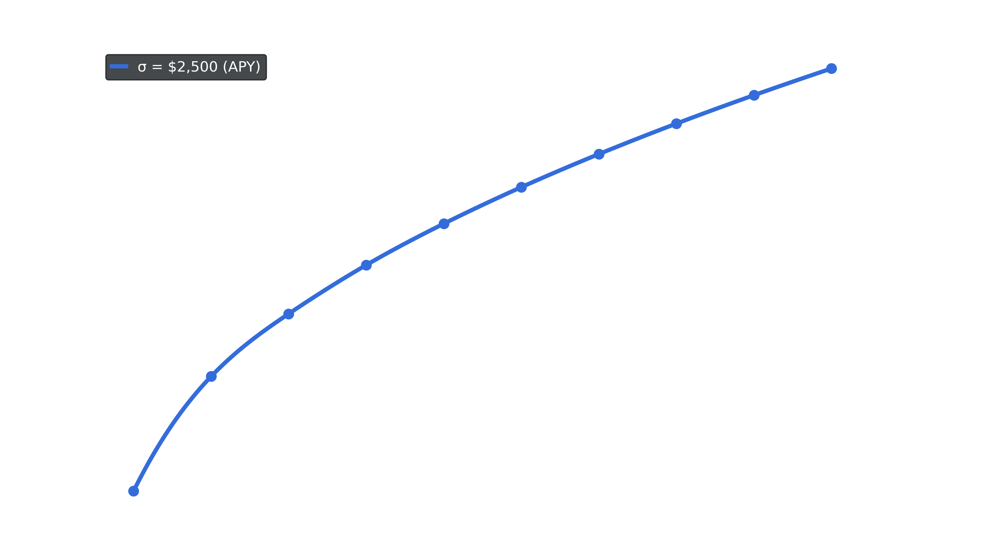

---
layout:
  title:
    visible: true
  description:
    visible: true
  tableOfContents:
    visible: true
  outline:
    visible: true
  pagination:
    visible: true
---

# Venus Prime

### **Overview**

Venus Protocol is excited to announce Venus Prime, a revolutionary incentive program aimed to bolster user engagement and growth within the protocol. An integral part of Venus Tokenomics v3.1, Venus Prime aims to enhance rewards and promote $XVS staking, focusing on markets including USDT, USDC, BTC and ETH.

### **Venus Prime Essentials**

Venus Prime's uniqueness lies in its self-sustaining rewards system, instead of external sources, rewards are derived from the protocol's revenue, fostering a sustainable and ever-growing program.

Eligible $XVS holders will receive a unique, non-transferable Soulbound Token, which boosts rewards across selected markets.

**Prime Tokens:**

Venus Prime encourages user commitment through two unique Prime Tokens:

1. **Revocable Prime Token:**
   * Users need to stake at least 1,000 XVS for 90 days in a row.
   * After these 90 days, users can mint their Prime Token.
   * If a user decides to withdraw XVS and their balance falls below 1000, their Prime Token will be automatically revoked.
   * The limit to the number of revocable Prime tokens is 500 on BNB chain. [Source](https://app.venus.io/#/governance/proposal/201). It can be changed with a VIP.
2. **Irrevocable "OG" Prime Token (Phase 2):**
   * _To be defined_

<figure><figcaption></figcaption></figure>

### **Expected Impact and Launch**

Venus Prime aims to incentivize larger stake sizes and diverse user participation. This is expected to significantly increase the staking of XVS, the Total Value Locked (TVL), and market growth.

Venus Prime intends to promote user loyalty and the overall growth of the protocol. By endorsing long-term staking, discouraging premature withdrawals, and incentivizing larger stakes, Venus Prime sets a new course in user engagement and liquidity, contributing to Venus Protocol's success.

Stake your $XVS tokens today to be eligible for Venus Prime, an exciting new venture in the DeFi landscape.

### Technical Reward Details

**Reward Formula: Cobb-Douglas function**

$$
Rewards_{i,m} = \Gamma_m \times \mu \times \frac{\tau_{i}^\alpha \times \sigma_{i,m}^{1-\alpha}}{\sum_{j,m} \tau_{j}^\alpha \times \sigma_{j,m}^{1-\alpha}}
$$

Where:

* $$Rewards_{i,m}$$ = Rewards for user $$i$$ in market $$m$$
* $$\Gamma_m$$ = Protocol Reserve Revenue for market $$m$$
* $$μ$$ = Proportion to be distributed as rewards
* $$α$$ = Protocol stake and supply & borrow amplification weight
* $$τ_{i}​$$ = XVS staked amount for user $$i$$
* $$\sigma_i$$ = Sum of **qualified** supply and borrow balance for user $$i$$
* $$∑_{j,m}​$$ = Sum for all users $$j$$ in markets $$m$$

**Qualifiable XVS Staked:**

$$
\tau_i = \begin{cases} \min(100000, \tau_i) & \text{if } \tau_i \geq 1000 \\ 0 & \text{otherwise} \end{cases}
$$

**Qualifiable supply and borrow:**

$$
\begin{align*} \sigma_{i,m} &= \min(\tau_i \times borrowMultiplier_m, borrowedAmount_{i,m}) \\ &+ \min(\tau_i \times supplyMultiplier_m, suppliedAmount_{i,m}) \end{align*}
$$

_Note: There will be a limit for the qualifiable supply and borrow amounts, set by the staked XVS limit and the market multiplier._

### User Reward Example:

**Model Parameters**

* $$α$$ = 0.5
* $${\sum_{j,BTC} \tau_{j}^\alpha \times \sigma_{j,BTC}^{1-\alpha}}$$ = 744,164
* $$\Gamma_{BTC}$$ = 8 BTC
* $$\mu$$ = 0.2
* BTC Supply Multiplier = 2
* XVS Price = $4.0

**User Parameters**

| User Parameters | Token Value | USD Value |
| --------------- | ----------- | --------- |
| Staked XVS      | 1,200       | $4,800    |
| BTC Supply      | 0.097       | $2,500    |

**Qualifiable Staked XVS**

$$\tau_i=min(100000,\text{ } 1200)$$

**Qualifiable Supply and Borrow**

$$\sigma_{i,\text{BTC}} = \textit{min}(\text{\$9600}, \text{\$2500})$$

**User Rewards**

$$Rewards_{i, BTC} = 8\times 0.2\times \dfrac{1,200^{0.5}\times 2,500^{0.5}}{744,164}$$

$$Rewards_{i, BTC} = \ 0.00372$$

$$\text{User APY Increase} = \dfrac{0.00372}{0.097} = 3.88\%$$

**Expected Rewards Function**

Rewards in the Venus Prime program will automatically increase as a user increases its XVS Stake, so long as the amount staked and market participation fall within the limits outlined in the "Technical Reward Details" section below.

<figure><figcaption>
<em>Please note that the rewards can vary based on the total market participation and the amount of XVS staked, as illustrated by the formula and example above.</em>
</figcaption></figure>

The graph above demonstrates the relationship between an increased XVS staked amount and its effect on market rewards, assuming a constant participation of $2.5K USD in the BTC supply market. This helps visualize how an increase in the staked amount influences the APY.
