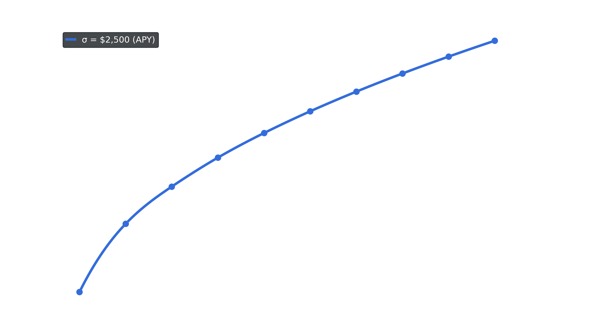

---
layout:
  title:
    visible: true
  description:
    visible: true
  tableOfContents:
    visible: true
  outline:
    visible: true
  pagination:
    visible: true
---

# Venus Prime

### **Overview**

Venus Prime is the protocol's flagship incentive program, designed to reward long-term, committed users by boosting their yield across selected markets. It focuses on the core markets USDT, USDC, BTC and ETH, and promotes sustained $XVS staking.

Venus Prime is powered by two contracts:

* **PrimeV2** — the boost engine. It holds each user's non-transferable (Soulbound) Prime token, tracks per-market scores, and distributes boosted rewards funded by protocol revenue.
* **PrimeLeaderboard** — the eligibility engine. It measures how much $XVS each user has staked and for how long, producing a time-weighted **Effective Stake** that ranks users for Prime eligibility.

### **Venus Prime Essentials**

Venus Prime's uniqueness lies in its self-sustaining rewards system: instead of relying on external sources or token emissions, rewards are derived from the protocol's revenue, fostering a sustainable and ever-growing program.

Eligible $XVS stakers receive a single, non-transferable Soulbound Prime token, which boosts rewards across the selected markets. The token is capped at a configurable supply (`tokenLimit`, **500** by default), changeable via VIP.

#### Eligibility: time-weighted Effective Stake

Prime eligibility is no longer a fixed "stake X for Y days" rule. Instead, PrimeLeaderboard computes an **Effective Stake** that rewards both the size and the age of each XVS deposit.

Every deposit and withdrawal in the XVS Vault is reported to PrimeLeaderboard, which records individual deposit tranches and applies a duration-based multiplier to each:

| Holding duration | Multiplier |
| --- | --- |
| < 30 days | 1.0x (base) |
| ≥ 30 days | 1.3x |
| ≥ 60 days | 1.6x |
| ≥ 90 days | 2.0x (cap) |

A user's Effective Stake is the sum, across all of their active deposits, of:

```
amount × multiplier(holdingDuration) × min(holdingDuration, 90 days)
```

Withdrawals are processed **LIFO** (newest deposits first), so a user's oldest, highest-multiplier stake is preserved for as long as possible. The tiers and the 90-day cap are configurable by governance via `setMultiplierTiers`.

#### Minting a Prime token

The primary minting path is **governance issuance**. After each epoch, a keeper reads the leaderboard off-chain (via `getEffectiveStakeBatch`), ranks users, and governance mints Prime tokens to the qualifying users with the ACM-gated `issue`/`issueBatch` functions (and revokes them, when needed, via `burn`/`burnBatch`).

A **permissionless minting** window is available as a fallback and is **disabled by default**. It only becomes usable if governance opens it by setting a minimum Effective Stake threshold with `setMintThreshold(threshold, deadline)`; until then, `mintThreshold` is `0` and `claimPrime` reverts. When open, anyone can call `claimPrime(user)` (or `claimPrimeBatch`) to mint a Prime token for any user whose Effective Stake is at or above the threshold, until the optional deadline passes. This serves as a last resort if the keeper-driven flow is unavailable. Governance can close it again at any time by setting the threshold back to `0`.

There is no separate "revocable" vs. "irrevocable" token — there is a single Prime token whose lifecycle is managed by governance based on the leaderboard.

### **Expected Impact**

Venus Prime incentivizes larger stake sizes and, through the time-weighted leaderboard, rewards users who keep their XVS staked. This is expected to increase XVS staking, Total Value Locked (TVL), and market growth, while discouraging premature withdrawals.

Stake your $XVS tokens today to climb the leaderboard and become eligible for Venus Prime.

### Technical Reward Details

Once a user holds a Prime token, their boosted rewards in each market are distributed with a Cobb-Douglas function, weighting their XVS stake against their qualified supply and borrow balances.

**Reward Formula: Cobb-Douglas function**

$$
Rewards_{i,m} = \Gamma_m \times \mu \times \frac{\tau_{i}^\alpha \times \sigma_{i,m}^{1-\alpha}}{\sum_{j,m} \tau_{j}^\alpha \times \sigma_{j,m}^{1-\alpha}}
$$

Where:

* $$Rewards_{i,m}$$ = Rewards for user $$i$$ in market $$m$$
* $$\Gamma_m$$ = Protocol Reserve Revenue for market $$m$$
* $$μ$$ = Proportion to be distributed as rewards
* $$α$$ = Protocol stake and supply & borrow amplification weight
* $$τ_{i}​$$ = XVS staked amount for user $$i$$
* $$\sigma_i$$ = Sum of **qualified** supply and borrow balance for user $$i$$
* $$∑_{j,m}​$$ = Sum for all users $$j$$ in markets $$m$$

**Qualifiable supply and borrow:**

$$
\begin{align*} \sigma_{i,m} &= \min(\tau_i \times borrowMultiplier_m, borrowedAmount_{i,m}) \\ &+ \min(\tau_i \times supplyMultiplier_m, suppliedAmount_{i,m}) \end{align*}
$$

_Note: There is a limit for the qualifiable supply and borrow amounts, set by the staked XVS value and the market multiplier._

### User Reward Example:

**Model Parameters**

* $$α$$ = 0.5
* $${\sum_{j,BTC} \tau_{j}^\alpha \times \sigma_{j,BTC}^{1-\alpha}}$$ = 744,164
* $$\Gamma_{BTC}$$ = 8 BTC
* $$\mu$$ = 0.2
* BTC Supply Multiplier = 2
* XVS Price = $4.0

**User Parameters**

| User Parameters | Token Value | USD Value |
| --------------- | ----------- | --------- |
| Staked XVS      | 1,200       | $4,800    |
| BTC Supply      | 0.097       | $2,500    |

**Qualifiable Supply and Borrow**

$$\sigma_{i,\text{BTC}} = \textit{min}(\text{\$9600}, \text{\$2500})$$

**User Rewards**

$$Rewards_{i, BTC} = 8\times 0.2\times \dfrac{1,200^{0.5}\times 2,500^{0.5}}{744,164}$$

$$Rewards_{i, BTC} = \ 0.00372$$

$$\text{User APY Increase} = \dfrac{0.00372}{0.097} = 3.88\%$$

**Expected Rewards Function**

Rewards in the Venus Prime program automatically increase as a user increases its XVS stake, so long as the amount staked and market participation fall within the limits outlined in the "Technical Reward Details" section.

<figure><figcaption><p><em>Please note that the rewards can vary based on the total market participation and the amount of XVS staked, as illustrated by the formula and example above.</em></p></figcaption></figure>

The graph above demonstrates the relationship between an increased XVS staked amount and its effect on market rewards, assuming a constant participation of $2.5K USD in the BTC supply market. This helps visualize how an increase in the staked amount influences the APY.
