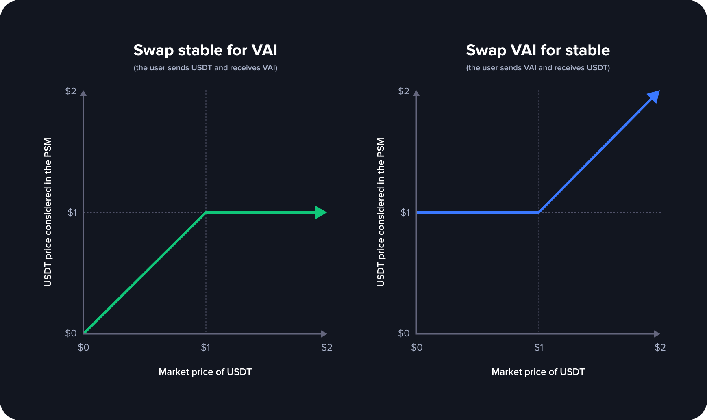

# Peg Stability Module (PSM)

## Overview

The Peg Stability Module (PSM) is a crucial component of the Venus Protocol designed to maintain the peg of the VAI stablecoin to $1. It functions similarly to the system provided by MakerDAO for DAI. The PSM contract works with two stablecoins: VAI (the target stablecoin) and USDT (used to help maintain the peg). The main features of the PSM are as follows:

**Convert Functionality**:
- Users can exchange VAI and USDT with a fixed conversion rate of 1 VAI = $1.
- Users can send VAI to the PSM and receive USDT if enough USDT is available in the PSM.
- Users can send USDT to the PSM and receive VAI, provided that the PSM hasn't reached its maximum allowed minted VAI limit.
  
**No Stability Fee**

The VAI minted through the PSM does not accrue any interest or stability fee.

**Configurable Parameters**: 

The PSM contract has three configurable variables, settable via the Venus Improvement Proposal (VIP):
  - `feeIn`: Fee charged when users send USDT to the PSM.
  - `feeOut`: Fee charged when users send VAI to the PSM.
  - `maxMintedVAI`: The maximum amount of VAI that the PSM can distribute. Converts that exceed this limit will be reverted.
**Fees Sent to Treasury**: The collected fees are sent to the Venus Treasury contract in each operation.
**Integration with Oracle Price**: The PSM considers the USD value of the stablecoin to peg VAI to its value accurately.

## Convert Functions

### Function `swapStableForVAI`

This function allows users to exchange stablecoins (USDT) for VAI.

**Expected Parameters**:
- `receiver`: Address of the user who will receive the VAI.
- `amount`: The amount of stablecoin (USDT) the sender wants to convert.

The received stablecoins will be held by the PSM, and the fee specified by `feeIn` will be applied.

This function returns the amount of VAI transferred to the receiver.

### Function `swapVAIForStable`

This function enables users to exchange VAI for stablecoins (USDT).

**Expected Parameters**:
- `receiver`: Address of the user who will receive the stablecoins.
- `amount`: The expected amount of stablecoins (USDT) the user should receive.

The received VAI will be burnt, and the fee specified by `feeOut` will be applied.

This function returns the amount of VAI transferred from the sender (burnt + fee).

## Preview Functions

The PSM also offers preview functions that help users estimate the outcome of convert operations:

### `previewSwapVAIForStable(uint256 stableTknAmount)`
Returns the amount of VAI that the sender would transfer (burnt + fee) to receive the specified stablecoin amount.
### `previewSwapStableForVAI(uint256 stableTknAmount)`
Returns the amount of VAI that the receiver would receive after executing the `swapVAIForStable` function with the specified stablecoin amount.

## Integration of the Oracle Price

<figure><figcaption></figcaption></figure>

To protect the value of VAI and consider the USD value of the stablecoin, the PSM integrates with an Oracle Price system. The following rules are applied:

**swapVAIForStable** (the user sends VAI and receives USDT)
- If the oracle price of the stablecoin is below $1, the conversion rate is 1 stablecoin = $1.
- If the oracle price of the stablecoin is above $1, the conversion rate is 1 stablecoin = oracle price.

**swapStableForVAI** (the user sends USDT and receives VAI)
- If the oracle price of the stablecoin is below $1, the conversion rate is 1 stablecoin = oracle price.
- If the oracle price of the stablecoin is above $1, the conversion rate is 1 stablecoin = $1.

The PSM thus ensures that the VAI remains stable and appropriately pegged to its value.

## Examples


Please note that the conversion rates of **USDT/USD** are determined based on the data provided by our oracles.


### **swapVAIForStable**

#### **1 USDT = $0.90**
  - Input: The user wishes to receive 1 USDT.
  - Calculation: The conversion rate to consider is max(1, 0.9) => 1 USDT = $1 = 1 VAI.
  - The user needs to send (1 USDT * 1 $/USDT) 1 VAI + fees.
  - Assuming feeOut = 10%, 0.10 VAI will be sent to the treasury, and 1 VAI will be burnt, resulting in a total of 1.1 VAI provided by the user.
  - The fee is calculated considering the "principal" VAI amount that we are to burn (1 VAI = $1).

#### **1 USDT = $1.1**
  - Input: The user desires to receive 10 USDT.
  - Calculation: The conversion rate to consider is max(1, 1.1) => 1 USDT = $1.1 = 1.1 VAI.
  - The user needs to send (10 USDT * 1.1 $/USDT) 11 VAI + fees.
  - Assuming feeOut = 10%, 1.1 VAI will be sent to the treasury, and 10 VAI will be burnt, resulting in a total of 11.1 VAI provided by the user.
  - The fee is calculated considering the "principal" VAI amount that we are to burn (11 VAI = $11).

### **swapStableForVAI**

#### **1 USDT = $0.90**
  - Input: The user wishes to send 10 USDT to the PSM.
  - Calculation: The conversion rate to consider is min(1, 0.9) => 10 USDT = $9 = 9 VAI.
  - The user will receive 10 USDT * 0.9 = 9 VAI (- fees).
  - Assuming feeIn = 10%, 0.9 VAI will be sent to the treasury, and 8.1 VAI will be sent to the user.
  - The fee is calculated considering the "principal" VAI amount (9 VAI = $9).

#### **1 USDT = $1.1**
  - 1 USDT = $1.1 (conversion rate according to our oracles)
  - Input: The user wishes to send 10 USDT to the PSM.
  - Calculation: The conversion rate to consider is min(1, 1.1) => 10 USDT = $10 = 10 VAI.
  - The user will receive 10 USDT * 1.0 = 10 VAI (- fees).
  - Assuming feeIn = 10%, 1 VAI will be sent to the treasury, and 9 VAI will be sent to the user.
  - The fee is calculated considering the "principal" VAI amount (10 VAI = $10).


Please note that this documentation is designed to be user-friendly and does not cover the technical implementation details of the Peg Stability Module. For technical information, developers and smart contract auditors can refer to the [smart contract code](https://github.com/VenusProtocol/venus-protocol/blob/develop/contracts/PegStability/PegStability.sol) and the associated [Venus Improvement Proposals (VIPs)](https://app.venus.io/#/governance).

