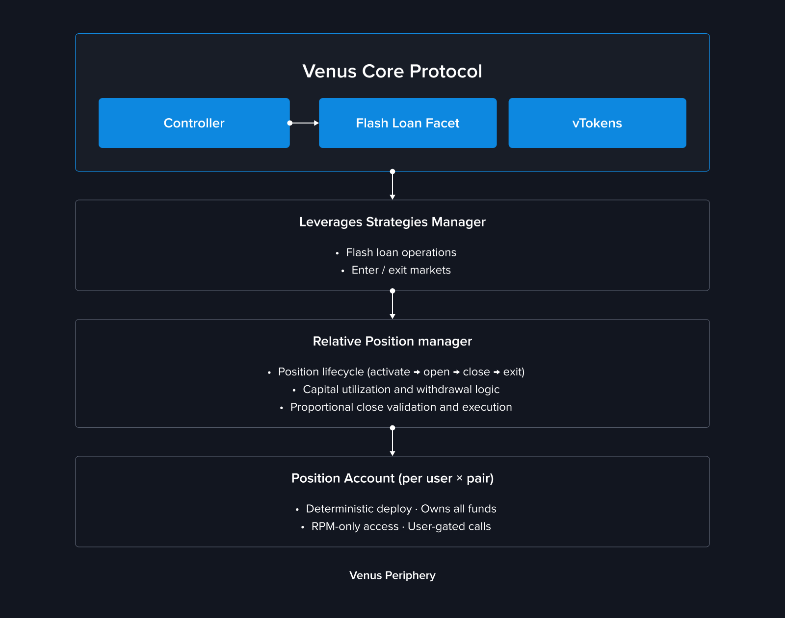
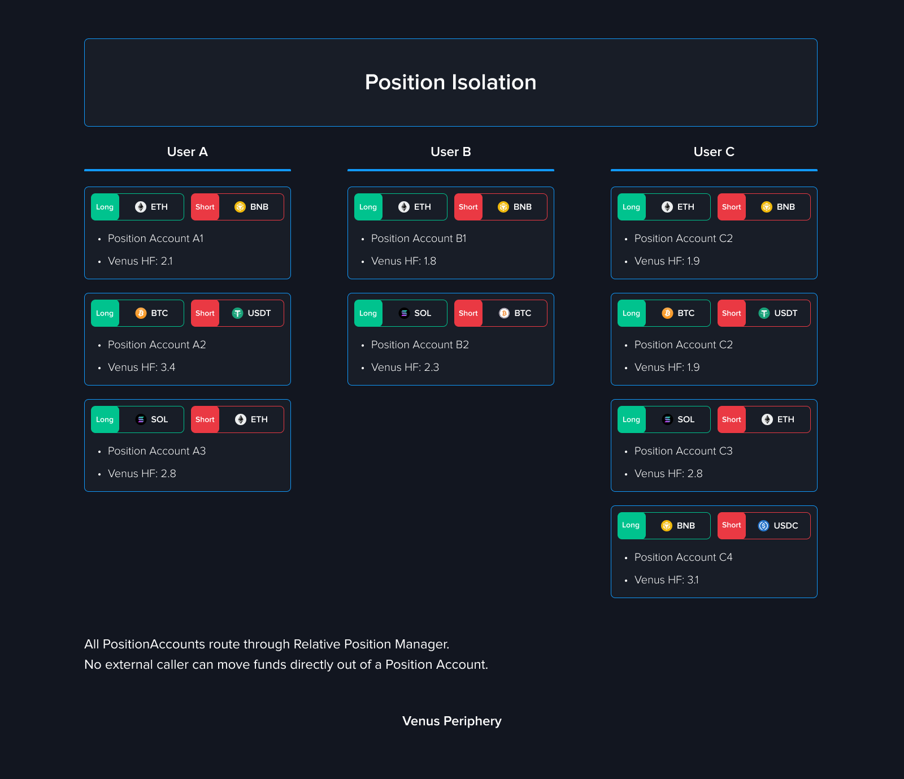

# Venus Trade


The published architecture and deployment records are scoped to the BNB Chain Core Pool. Current user availability still depends on the live RelativePositionManager configuration and pause state, active DSA markets, supported market pairs and swap routes, and the current Venus interface. Verify those before treating a pair or action as available.


## Overview

**Venus Trade** is a relative performance trading product built on top of Venus Protocol's existing lending and borrowing infrastructure. It allows users to express a view that one asset will outperform another — packaged into a single, easy-to-manage position.

Instead of requiring every lending and borrowing step to be submitted separately, the published contracts support combined activation-and-open and proportional close flows. Some full-close flows can also be combined with deactivation; the exact actions presented by the current interface may vary.

This is not directional trading. Trade positions profit (or lose) based on the **relative price movement between two assets**, regardless of whether the overall market is going up or down.

## What's New

Trade introduces a set of new periphery contracts and capabilities alongside Venus's existing lending infrastructure:

| Component | Description |
| --- | --- |
| **RelativePositionManager** | The main orchestration contract that manages the full lifecycle of Trade positions — from activation and opening to proportional closing and deactivation |
| **PositionAccount** | A dedicated smart contract account deployed per user per trading pair. Its collateral, borrow positions, and yield accrual are accounted for separately from other PositionAccounts |
| **Paired Positions** | Long collateral and short debt managed under one position record; account health also includes the configured DSA collateral |
| **Default Settlement Asset (DSA)** | A settlement-asset vToken selected from the manager's governance-configured active DSA list and supplied as initial principal. It contributes to collateral backing the short borrow, and realized profits and losses are settled in that asset |
| **Proportional Closing** | Flexible partial or full position closing using on-chain flash loans and token swaps, with automatic dust handling |
| **Capital Utilization Tracking** | Real-time calculation of how much deposited collateral is locked by open positions, enabling accurate withdrawable balance reporting |

## Architecture Overview

Trade is built as a peripheral orchestration layer that interacts with existing Venus Core Pool, Comptroller, and vToken interfaces. A PositionAccount is a regular Core account from the Comptroller's perspective and remains subject to Core market and liquidation rules.


This overview describes the published BNB Chain architecture. Before integrating, verify the live RelativePositionManager proxy implementation, PositionAccount implementation and clone immutables, and ACM permissions at a recorded block using the [deployed-contracts page](../deployed-contracts/periphery.md). Repository ABIs and deployment records alone do not prove the current on-chain configuration.


<figure><figcaption></figcaption></figure>

Each user gets a **dedicated PositionAccount** per trading pair, deployed as a minimal proxy clone. This account holds the position's funds, enters markets on the Comptroller, and delegates supported operations to the RelativePositionManager and LeverageStrategiesManager.

Each PositionAccount is the on-chain holder of that position's collateral and debt. Its own operational entry points accept calls only from the configured RelativePositionManager, and normal user lifecycle operations are scoped to the caller's stored position. This is not an exclusive-control guarantee: standard Venus liquidations can seize vTokens held by the account, the account delegates supported actions to the RelativePositionManager and LeverageStrategiesManager through the Comptroller, and an ACM-authorized caller can use `executePositionAccountCall` for emergency or administrative calls from a PositionAccount. These protocol and governance paths do not require a contemporaneous transaction from the account owner.

PositionAccounts are deployed as deterministic EIP-1167 clones with CREATE2. The salt is `keccak256(user, longVToken, shortVToken)`, but the resulting address also depends on the RelativePositionManager deployer address and its configured PositionAccount implementation. `getPositionAccountAddress` therefore predicts a stable address only for that specific manager deployment and implementation; the same wallet and pair can produce a different address on another chain or manager deployment.

### Position Isolation

Every `(user, trading pair)` combination has separate PositionAccount balances, debt, and health calculations; debt in one PositionAccount is not directly netted against another. PositionAccounts still use shared Venus Core markets, oracles, liquidity, rates, periphery contracts, and governance, so market-wide and protocol-wide conditions can affect multiple positions.

<figure><figcaption></figcaption></figure>

## Key Concepts

### Long Leg and Short Leg

A Trade position's relative exposure is described through two distinct markets; the configured DSA is an additional collateral and settlement component and may use the same market as either the long or short side:

- **Long side** — the asset you believe will outperform. The PositionAccount supplies this asset into Venus.
- **Short side** — the asset you believe will underperform. The PositionAccount borrows this asset from Venus.

The product can present them as one position, but the on-chain close paths still calculate and execute distinct debt-repayment, profit-conversion, or loss-coverage legs with separate amounts and swap data.

### Default Settlement Asset (DSA)

When activating a position, you select a **Default Settlement Asset** from the manager's governance-configured DSA vTokens that are active for new activations. Published interfaces may offer stablecoins such as USDT or USDC, but the source does not hardcode the list: governance can add a listed vToken or deactivate one for new activations. The selected asset is supplied as initial principal in the PositionAccount and contributes to collateral backing the short borrow. The collateral factors of the DSA and long asset contribute to borrow capacity and maximum available leverage. Realized profits and losses are settled in the selected DSA.

### Leverage

Trade supports leveraged positions, amplifying your exposure to relative price movements. The target leverage setting is recorded when a position is activated. While the position is active, the user can still increase exposure with `scalePosition` and can supply more principal; the maximum additional borrow is recalculated from current position values and collateral factors, so actual exposure and the effective limit can change over time.

### Capital Utilization

Capital utilization tells you how much of your deposited collateral is currently locked by your open position. The remaining portion — **Available Capital** — can support an increase to that position or be withdrawn, subject to the live risk checks.

## How It Works

### Step 1 — Activate and Open

Deposit your DSA collateral, select a trading pair, set your leverage, and submit in one transaction. Behind the scenes, the system:

1. Deploys a dedicated PositionAccount for this pair (first time only)
2. Enters the DSA market and supplies your collateral
3. Flash loans the short asset via LeverageStrategiesManager
4. Swaps the short asset to the long asset
5. Supplies the long asset to Venus, establishing the leveraged position

### Step 2 — Monitor and Manage

Once open, your position generates yield automatically:

- **Supply APY** on the long asset
- **DSA APY** on your collateral
- minus **Borrow APY** on the short asset

You can monitor Health Factor, PnL, entry price, and liquidation price at any time. Available management actions include increasing the position, supplying additional collateral, proportionally reducing the position, withdrawing unused collateral, or fully closing and deactivating.

### Step 3 — Reduce and Exit

Reducing is proportional — the contract accepts `closeFractionBps` from 1 to 10,000 basis points, so the source-level range is **0.01% to 100%** (`1 bp = 0.01%`). Profit and loss closes use different parameter sets and swap legs: profit output can be converted into DSA collateral, while a loss close can redeem DSA collateral to cover remaining short debt.

After a full reduce, the PositionAccount can remain active. `deactivatePosition` requires the short debt to be zero, redeems remaining long and DSA balances to the user, and marks the position inactive; it does not destroy the PositionAccount. The same `(user, long, short)` account can be activated again later, including with a different currently active DSA.

The published contract exposes two atomic combined paths: `closeWithProfitAndDeactivate` and `closeWithLossAndDeactivate`. Each hardcodes a 100% close and then deactivates, but callers must choose the path and provide its required swap parameters. Whether the current Venus interface offers either path as a one-click action is a separate runtime/UI availability question.

## Impact on Existing Users

Trade is implemented through periphery contracts that interact with existing Venus Core markets. Trade PositionAccounts use the same market liquidity, utilization, interest rates, oracle values, and liquidation mechanisms as other Core accounts, so they can affect and be affected by normal shared-market conditions.

## Security

Published RelativePositionManager and PositionAccount audit reports are available in the [Security & Audits](../security-and-audits.md) section. An audit report applies to the code and version reviewed; verify the live proxy and implementation against the report before treating it as coverage for a deployment.

For a full technical breakdown of the implementation, see the [Trade Technical Article](../technical-reference/reference-technical-articles/trade.md).
