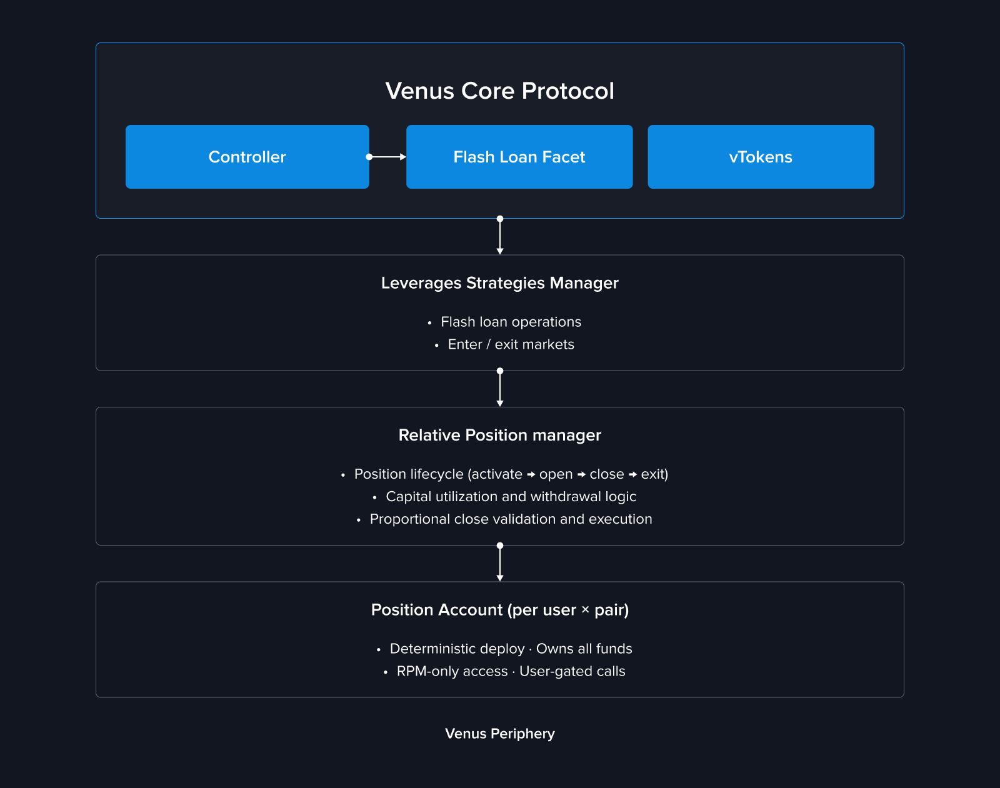
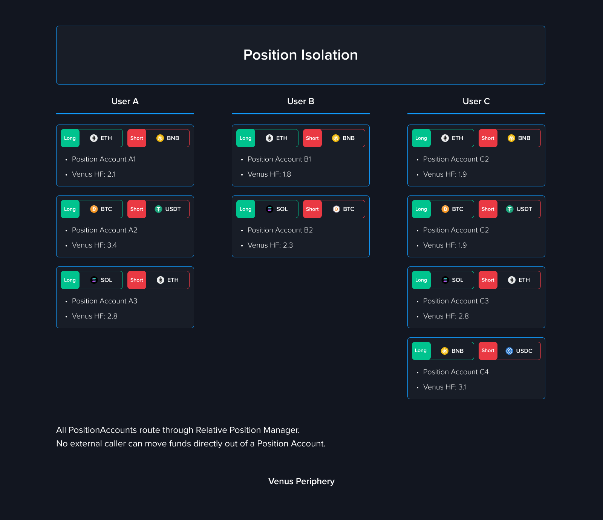

# Venus Yield+


Available on BNB Chain Core Pool.


## Overview

**Venus Yield+** is a relative performance trading product built on top of Venus Protocol's existing lending and borrowing infrastructure. It allows users to express a view that one asset will outperform another — packaged into a single, easy-to-manage position.

Instead of manually managing separate lending and borrowing positions across multiple markets, Yield+ combines everything into **one unified action** with automated execution, proportional closing, and built-in yield generation.

This is not directional trading. Yield+ positions profit (or lose) based on the **relative price movement between two assets**, regardless of whether the overall market is going up or down.

## What's New

Yield+ introduces a set of new periphery contracts and capabilities alongside Venus's existing lending infrastructure:

| Component | Description |
| --- | --- |
| **RelativePositionManager** | The main orchestration contract that manages the full lifecycle of Yield+ positions — from activation and opening to proportional closing and deactivation |
| **PositionAccount** | A dedicated smart contract account deployed per user per trading pair. All collateral, borrow positions, and yield accrual live here, fully isolated from other positions |
| **Paired Positions** | Long and short legs treated as a single unit with combined PnL, health, and lifecycle management |
| **Default Settlement Asset (DSA)** | A designated stablecoin (USDT or USDC) that users must supply as the initial collateral backing the position. All borrows of the short asset are secured against this DSA collateral, and all realized profits and losses are settled in DSA |
| **Proportional Closing** | Flexible partial or full position closing using on-chain flash loans and token swaps, with automatic dust handling |
| **Capital Utilization Tracking** | Real-time calculation of how much deposited collateral is locked by open positions, enabling accurate withdrawable balance reporting |

## Architecture Overview

Yield+ is built as a peripheral orchestration layer. No changes were made to the Venus Core Pool, Comptroller, or vToken contracts.

<figure><figcaption></figcaption></figure>

Each user gets a **dedicated PositionAccount** per trading pair, deployed as a minimal proxy clone. This account holds all funds, enters markets on the Comptroller, and delegates all position operations to the RelativePositionManager.

All funds inside a PositionAccount are **owned exclusively by that account** — no external party can move them. The only contract permitted to execute operations on a PositionAccount is the RelativePositionManager, and the RPM enforces that every call must originate from the account's owner (`msg.sender`). This means neither the RPM nor any third party can act on a user's position without the user's direct on-chain request.

PositionAccounts are **deterministically deployed** using the owner's `msg.sender` address and the trading pair as the salt. The same wallet will always produce the same PositionAccount address for a given pair — no registry lookup required.

### Position Isolation

Every `(user, trading pair)` combination gets its own isolated PositionAccount. Collateral, debt, and Health Factor are entirely separate — a loss or liquidation on one position cannot affect another.

<figure><figcaption></figcaption></figure>

## Key Concepts

### Long Leg and Short Leg

A Yield+ position always consists of two legs:

- **Long Leg** — the asset you believe will outperform. The system supplies this asset into Venus to earn lending yield.
- **Short Leg** — the asset you believe will underperform. The system borrows this asset from Venus.

You never manage these legs separately. Yield+ treats them as a single position.

### Default Settlement Asset (DSA)

When activating a position, you choose a **Default Settlement Asset** — either USDT or USDC. This stablecoin is supplied as the initial collateral into the PositionAccount and is the asset against which all borrows of the short asset are secured. The DSA's collateral factor determines the maximum borrow capacity and therefore the maximum available leverage. All realized profits and losses are also settled in DSA — think of it as the "home currency" for the entire position lifecycle.

### Leverage

Yield+ supports leveraged positions, amplifying your exposure to relative price movements. The maximum available leverage is determined by the collateral factors of the assets involved. Leverage is fixed at activation and cannot be changed while a position is open.

### Capital Utilization

Capital utilization tells you how much of your deposited collateral is currently locked by your open position. The remaining portion — **Available Capital** — can be used to open additional positions or withdrawn.

## How It Works

### Step 1 — Activate and Open

Deposit your DSA collateral, select a trading pair, set your leverage, and submit in one transaction. Behind the scenes, the system:

1. Deploys a dedicated PositionAccount for this pair (first time only)
2. Enters the DSA market and supplies your collateral
3. Flash loans the short asset via LeverageStrategiesManager
4. Swaps the short asset to the long asset
5. Supplies the long asset to Venus, establishing the leveraged position

### Step 2 — Monitor and Manage

Once open, your position generates yield automatically:

- **Supply APY** on the long asset
- **DSA APY** on your collateral
- minus **Borrow APY** on the short asset

You can monitor Health Factor, PnL, entry price, and liquidation price at any time. Available management actions include increasing the position, supplying additional collateral, proportionally reducing the position, withdrawing unused collateral, or fully closing and deactivating.

### Step 3 — Close

Closing is proportional — you specify what fraction of the position to close (1% to 100%) in a single transaction. Profits are automatically converted into DSA collateral. Losses are covered by your existing DSA collateral.

After a full close, the position account remains active for re-entry. Use **Deactivate** (Exit Market) to fully withdraw and shut down the position account.

## Impact on Existing Users

Yield+ is an entirely new feature built as a peripheral contract layer. **No changes were made** to the Venus Core Pool, vToken markets, interest rate models, Comptroller, oracles, or any existing protocol infrastructure. Existing users are not affected.

## Security

The RelativePositionManager and PositionAccount contracts were independently audited before deployment. Reports are available in the [Security & Audits](../security-and-audits.md) section.

For a full technical breakdown of the implementation, see the [Yield+ Technical Article](../technical-reference/reference-technical-articles/yield-plus.md).
